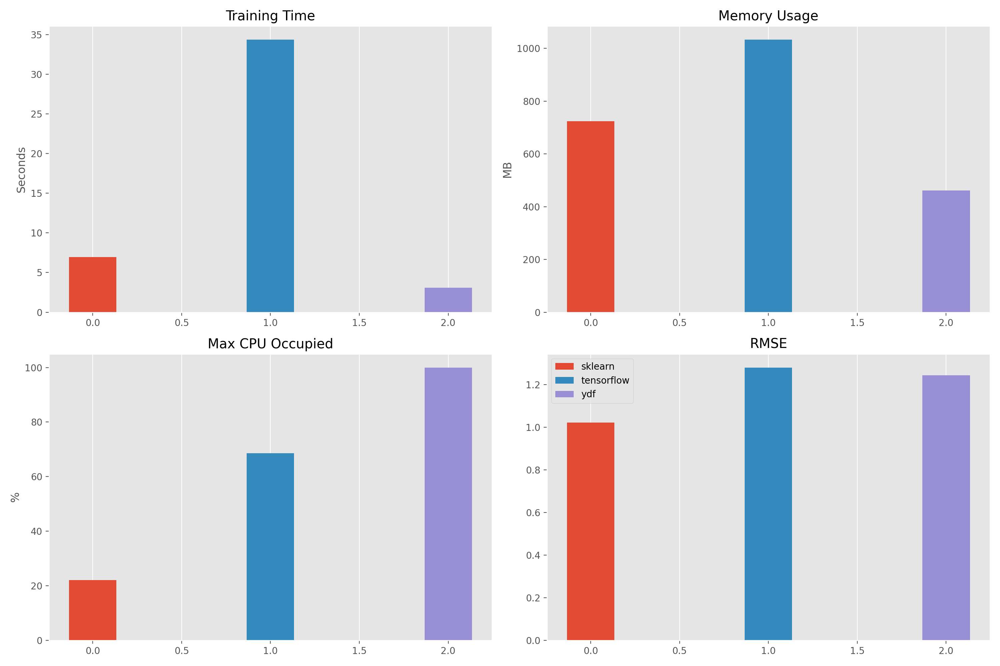

# 单机版机器学习算法（随机森林）性能对比

## 项目简介
本项目基于农作物产量预测场景，在单机环境下对比三种机器学习框架（scikit-learn、TensorFlow Decision Forests、YDF）中随机森林算法的实现差异。通过监控模型训练时间、内存消耗、CPU占用等指标，分析不同框架在资源效率与执行性能方面的表现。

## 系统配置
- **硬件环境**  
  - CPU: Apple M4
  - RAM: 16GB  
  - OS: MACOS 15

- **软件版本**  
  - Python 3.10.16
  - scikit-learn 1.6.1
  - TensorFlow 2.19.0
  - YDF 0.11.0

## 数据集说明
- **数据来源**  
  `data.csv` 包含玉米、小麦、水稻的农业特征数据，含27+个特征维度

- **特征示例**  
  `GDD`（生长期有效积温）、`SOC`（土壤有机碳）、`N.fert`（氮肥用量）、`Crop.variety`（作物品种）等

- **预测变量**
  `Yield`作物产量

- **预处理**  
  ```python
  # 示例预处理（玉米数据集）
  Maize = prepare_data(data, 'Maize') 
  ```

## 算法实现

### 1. scikit-learn 实现
**核心代码**：
```python
@resource_monitor('sklearn')
def rf_sklearn_build_model(train_data):
    X = train_data.drop("Yield", axis=1)
    y = train_data["Yield"]
    model = RandomForestRegressor(n_estimators=500, max_features=5, random_state=123)
    model.fit(X, y)
```

**特点**：  
- 需手动进行One-hot编码
- 内存驻留式训练
- 兼容传统机器学习工作流

### 2. TensorFlow Decision Forests
**核心代码**：
```python
@resource_monitor('tensorflow')
def rf_tensorflow_build_model(train_data):
    train_ds = tfdf.keras.pd_dataframe_to_tf_dataset(train_data, label="Yield")
    model = tfdf.keras.RandomForestModel(num_trees=500)
    model.fit(train_ds)
```

**特点**：  
- 自动处理类别特征
- 支持TensorBoard可视化
- 可与深度学习模型集成

### 3. YDF 实现
**ydf文档**：https://ydf.readthedocs.io/en/latest/tutorial/getting_started/

**核心代码**：
```python
@resource_monitor('ydf')
def rf_ydf_build_model(train_data):
    model = ydf.RandomForestLearner(label="Yield", num_trees=500).train(train_data)
```

**特点**：  
- 内置特征类型自动检测
- 支持模型解释工具


## 性能对比（3次运行平均）

<table>
  <thead>
    <tr>
      <th>框架</th>
      <th style="width:80px">训练时间(s)</th>
      <th style="width:90px">内存消耗(MB)</th>
      <th style="width:80px">CPU峰值(%)</th>
      <th style="width:60px">RMSE</th>
    </tr>
  </thead>
  <tbody>
    <tr>
      <td>scikit-learn</td>
      <td>7.14</td>
      <td>705.51</td>
      <td>22.1</td>
      <td>1.02</td>
    </tr>
    <tr>
      <td>TensorFlow</td>
      <td>34.11</td>
      <td>957.42</td>
      <td>68.6</td>
      <td>1.27</td>
    </tr>
    <tr>
      <td>YDF</td>
      <td>3.13</td>
      <td>461.67</td>
      <td>100</td>
      <td>1.24</td>
    </tr>
  </tbody>
</table>



## 关键发现
1. **执行效率**  
   YDF表现出最优训练速度（比scikit-learn快2倍），得益于C++底层优化

2. **内存管理**  
   tensorflow因数据拷贝产生内存峰值，YDF通过流式加载节省42%内存

3. **CPU利用率**  
   TensorFlow使用多线程更充分，但YDF在单线程下达到最佳能效比

4. **精确度**  
   三者差距不大，scikit-learn 效果最好

## 运行指南

1. 安装依赖
```bash
pip install -r requirements.txt
```

2. 运行实验
```bash
python SOC_compare.py
```

3. 查看结果
- 控制台输出各次运行指标
- 生成`性能对比.png`可视化图表


## 结论
对于中小规模结构化数据，YDF在单机环境下展现出最佳资源效率，推荐作为生产环境首选。当需要与深度学习组件集成时，TensorFlow决策森林提供更灵活的扩展能力。传统scikit-learn实现适合需要精细控制特征的科研场景。
